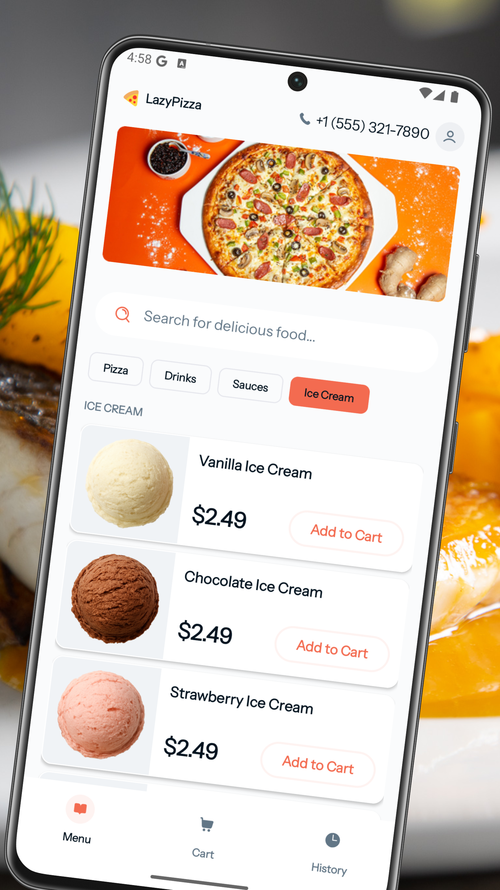
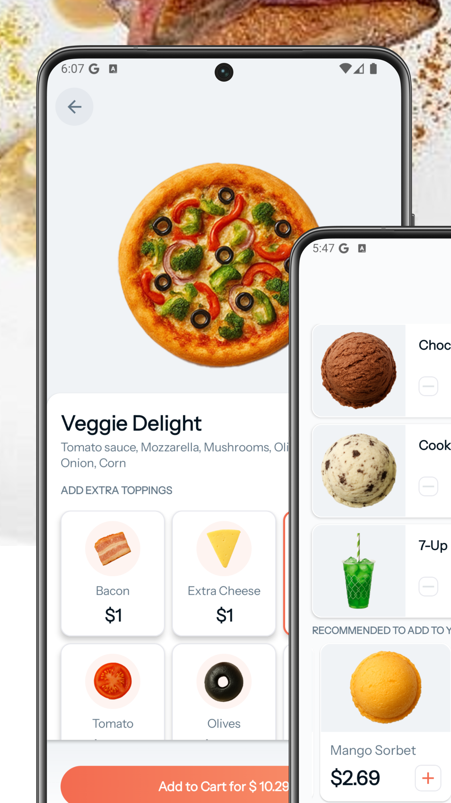
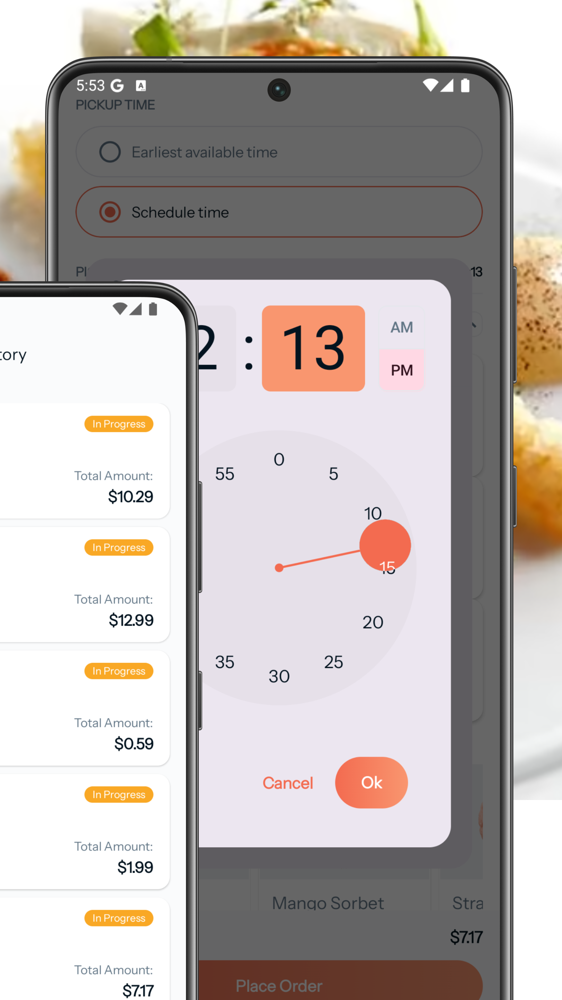

<div align="center">
  <a href="#">
    
  </a>

<h1 align="center">
<b><i>Lazy Pizza</i></b>
</h1>

<p align="center">
  
  
  
</p>

<p align="center">
  Food ordering built with a clean design and seamless checkout experience. ⚡  
  <br />
  <a href="#-screenshots">Screenshots</a> •
  <a href="#-features">Features</a> •
  <a href="#-tech-stack">Tech Stack</a> •
  <a href="#-getting-started">Getting Started</a> •
  <a href="#️-author">Author</a> •
  <a href="#-contributing">Contributing</a>
</p>
</div

---

Android app for exploring menu items, customizing add-ons, managing cart items, and complete orders through a seamless checkout flow. Built with Jetpack Compose, clean architecture principles, and Firebase, the app emphasizes performance, usability, and a smooth user experience.  

<p align="center">
  <!-- Google Play badge -->
  <a href="https://play.google.com/store/apps/details?id=com.tonyxlab.qrcraft" target="_blank">
    
  </a>
</p>

<p align="center">
  <!-- Demo GIF -->
  
</p>


---

## 📸 Screenshots

<p align="center">
 &nbsp;&nbsp;&nbsp;
 &nbsp;&nbsp;&nbsp;
 
</p>

---

## 📱 Features
- 🍕 Explore the menu and discover your perfect pizza
- 🧀 Personalize your order with tasty add-ons
- 🛒 Efforless cart updates and quantity control
- 💳 Smooth checkout from cart to confirmation
- ☁️ Cloud-powered data with Firebase
- 🔐 Safe and secure user sign-in
- ⚡ Fast, modern UI built with Jetpack Compose

---

## 🚀 Tech Stack

- 🟣 Kotlin — primary language
- 🎨 Jetpack Compose (Material 3) — modern declarative UI
- 🧱 Clean Architecture + MVVM — scalable app structure
- ☁ ️ Firebase Firestore — real-time cloud database
- 🔐 Firebase Authentication — secure user sign-in
- 💾 Room Database & DataStore — local persistence & preferences
- 🔄 Kotlin Coroutines & Flow — asynchronous & reactive programming
- 🧭 Navigation Compose — in-app navigation
- 🧩 Koin — dependency injection
- 🖼 Coil — asynchronous image loading
- 🛠 Timber — structured logging & debugging

---

## 🧰 Getting Started

### Prerequisites
- Android Studio [Panda](https://developer.android.com/studio) or Later 
- Android Device or Emulator running Android 6.0 (Marshmallow) or higher  

### Installation
1. Clone the repository:
   ```sh
   git clone https://github.com/Tonnie-Dev/LazyPizza

Use **Guest Account** for easy Login, alternatively use these credentials:

**Email:** +254 723 445813
**OTP:** 123456
## 🖋️ Author

**Tonnie** – [@Tonnie-Dev](https://github.com/Tonnie-Dev)

<p align="left">
 <a href="https://www.buymeacoffee.com/AgVrgB4N3r" target="_blank">
    
  </a>
  <a href="https://www.linkedin.com/in/antony-muchiri/" target="_blank">
    
  </a>
  <a href="https://twitter.com/Tonnie_Dev" target="_blank">
    
  </a>
</p>


## 🛂 Contributing

Contributions Lazy Pizza are welcome and appreciated! Whether it's a bug fix, new feature, improvement, or even a typo correction – you're more than welcome to jump in 🚀

If you are interested in seeing a particular feature implemented in this app, please open a new issue after which you can make a PR!

### 📜 License

This project is licensed under the [MIT License](./readme-assets/LICENSE).p